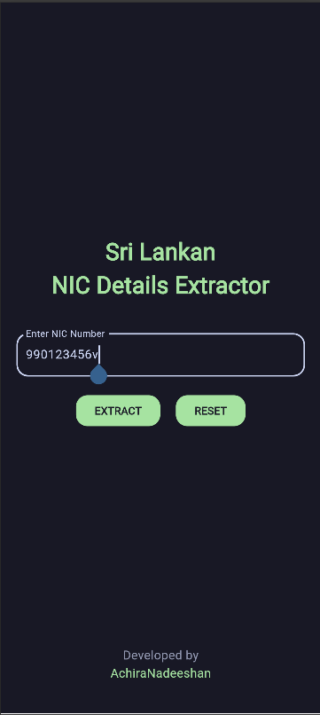
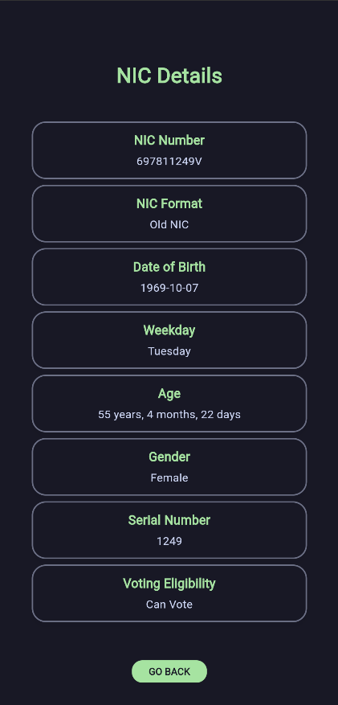

# Sri Lankan NIC Details Extractor
[About](#about) · [Features](#features) · [Tech Stack](#tech-stack) · [Screenshots](#screenshots) · [Installation](#installation) · [Insights](#folder-structure) · [Documentation](#dart-documentation) · [Contact](#contact)

---

## About
A Flutter application that extracts and decodes details from Sri Lankan National Identity Card (NIC) numbers. The app provides insights such as the date of birth, weekday, age, gender, and voting eligibility based on the NIC number entered.

## Features

- Extracts details from both old and new NIC formats.
- Displays the following details from the NIC:
  - NIC format (Old/New)
  - Date of birth
  - Weekday of birth
  - Age
  - Gender
  - Serial Number
  - Voting eligibility
- User-friendly interface designed using Material 3.
- State management and navigation handled with GetX.
- Validates NIC input and and handles errors effectively.

## Tech Stack

- Flutter (UI Framework)
- Dart (Programming Language)
- GetX (State Management & Navigation)
- Material 3 (UI Design)
- URL Launcher (Launch URLs in the browser or external apps)

## Screenshots

<div align="center">

<table>
  <tr>
    <th><strong>Input Screen</strong></th>
    <th><strong>Result Screen</strong></th>
  </tr>
  <tr>
    <td align="center"></td>
    <td align="center"></td>
  </tr>
</table>

</div>


## Installation

1. **Clone the repository**
    ```sh
    git clone https://github.com/your-username/sri_lankan_nic_details_extractor.git
    cd sri_lankan_nic_details_extractor
    ```

2. **Install dependencies**
    ```sh
    flutter pub get
    ```
3. **Run the app**
    - To start the application on a connected emulator or device, use:

        ```sh
        flutter run
        ```

    - If you have multiple devices/emulators connected, list them first with:

        ```sh
        flutter devices
        ```
    - Then, select a specific device to run the app:
        ```sh
        flutter run -d <device_id>
        ```
    - Replace <device_id> with the ID shown in the flutter devices output.

### APK Release
To generate a release APK:

```sh
flutter build apk --release
```
The APK will be available in the ```build/app/outputs/flutter-apk/``` directory.

## Folder Structure
```css
lib/
│── main.dart
│
├── bindings/
│   ├── nic_binding.dart
│
├── controllers/
│   ├── nic_controller.dart
│
├── screens/
│   ├── input_screen.dart
│   ├── result_screen.dart
│
├── widgets/
│   ├── nic_input_field.dart
│   ├── result_card.dart
│
└── utils/
    ├── nic_decoder.dart
```

1. **main.dart** - This file initializes the app, sets up GetX navigation, and defines routes.
2. **nic_binding.dart** - Binds the controller to GetX dependency injection.
3. **nic_controller.dart** - Handles user input, validation, and decoding logic.
4. **input_screen.dart** - The input screen with a text field and decode button.
5. **result_screen.dart** - Displays extracted NIC details.
6. **nic_input_field.dart** - Input field widget.
7. **result_card.dart** - Card widget to display NIC details.
8. **nic_decoder.dart** - Handles NIC decoding logic.

## Dart Documentation  

The full API documentation for this project is available at:  

🔗 **[DartDocs](https://achiranadeeshan.github.io/sri_lankan_nic_details_extractor/dartdoc/)**  

## Contact
If you have any suggestions or find issues, feel free to open an issue in the repository or contact me:

**Email: hrachiranadeeshan@gmail.com**

